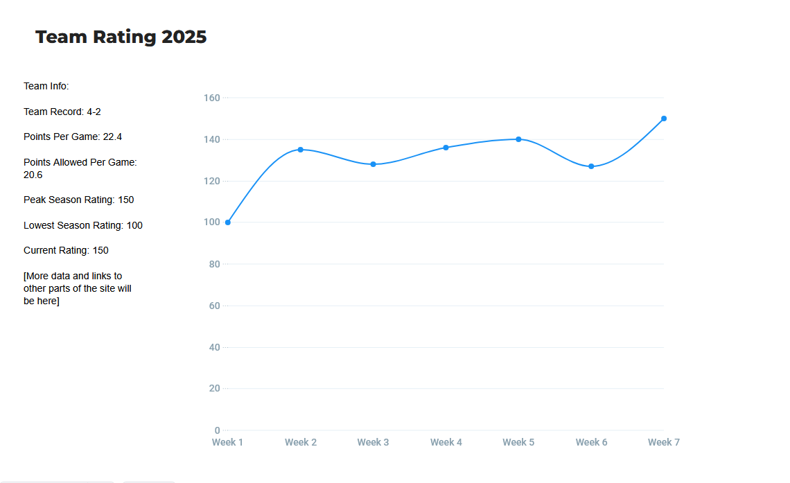

# Web Dev Starter Code

## Project Spec

My idea here is a website that hosts an Elo engine for NFL teams. For those unfamiliar, an Elo engine is a chess term that tracks a player's rating based on how they perform against other players. If you beat a highly ranked opponent, your rating jumps a lot, if you lose to that opponent, it only falls a little. Vice versa for playing against a lower rated opponent. What it should do is take information from a database of game results, and  do calculations using the Elo formula (I'd paste it but it's not necessary to put the specifics here) to give each team a "rating." I plan on having tabs on the site for a few past seasons, and live updating the current season. Each team would have data, as well as each season, so you can see how every team stacks up over the years. The target audience for something like this is obviously football fans. I think it would be a fun way to collect and share data in a way that the average fan can understand. There are a lot of statistics and analytics in sports journalism that most fans simply can't be expected to look into, so I think putting it all together into one number that illustrates how good a team actually is would be more efficient. I obviously don't expect this to be a perfect way to predict everything, but I do think it would be fun to have a quick way to look at current ratings and see how accurate the Elo style ranks are compared to actual future game results. Data management in this case seems relatively simple, there are plenty of resources that have all sorts of statistics about every single game (basically ever), so I think the only potentially problematic part would be live updates during a season. Maybe it's a bit of a stretch goal to have that happen automatically, without anyone having to add the data from new games, but I'll see what can be done about that. As far as user input, I'm considering a feature that would be like a "what if" test. You would be able to test how the ratings would be effected if a certain future game went either way. For this sort of thing you really wouldn't need user accounts, so I probably won't do anything like that. Maybe a forum would be fun to add after the main functionality, but I would consider that to probably be a stretch goal as well. Awhile back I made a similar site for NBA teams, but I didn't use AWS, I just added game result CSVs to my project, and used a front end framework. I think doing a project that's similar to one I've done in the past, but uses new techniques learned in this class, is a good idea because I won't get so bogged down in the logic, and can focus more on using the AWS features and making the site actually look good. My previous project was super bare bones because I had very little CSS experience. I think this should be a fun project, and I'm looking forward to seeing what other people come up with.

## Project Wireframe

This is a general idea of what the info page for a specific team might look like:

